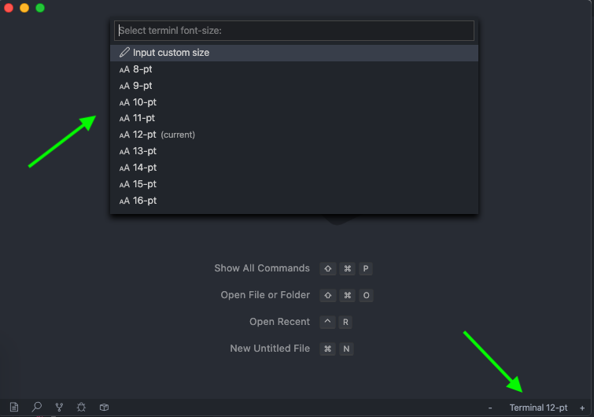

# Terminal Zoom

Control the terminal font-size from the status bar and command pallette.

## Screenshot

## How To Use

### Via the status bar

Click the `+` and `-` buttons to increase/decrease the terminal font-size by 1 pt.

Click the middle `Terminal` button to bring up a selection menu to set a custom size.

### Via the command pallette

Type any of these commands in the command pallette:

- `Terminal Zoom: Increase terminal font size`
- `Terminal Zoom: Decrease terminal font size`
- `Terminal Zoom: Set terminal font size`

## Usage Notes

The status bar buttons will be hidden if there are no terminals running. That way
we don't clog up the status bar if terminals are not in use.

## License

[MIT License](https://github.com/trybick/vscode-terminal-zoom/blob/master/LICENSE)
