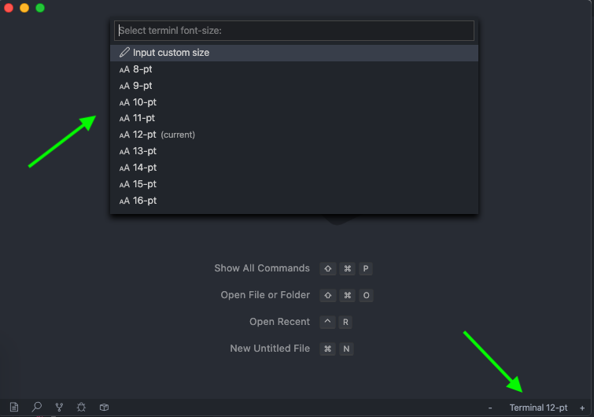

# Terminal Zoom

VSCode extension to control the terminal's font-size via status bar buttons and command pallette.

## Demo

## How To Use

### Using the Status Bar

Three buttons are added to the status bar:

- Click the `+` and `-` buttons on the status bar to increase/decrease the font-size by 1 pt
- Click the middle `Terminal` button to bring up a selection menu to set a custom size

### Using the Command Pallete

There are three command pallette commands:

- `Terminal Zoom: Increase terminal font size` - Increase size by 1 pt
- `Terminal Zoom: Decrease terminal font size` - Decrease size by 1 pt
- `Terminal Zoom: Set terminal font size` - Open custom selection menu

## License

[MIT License](https://github.com/trybick/vscode-terminal-zoom/blob/master/LICENSE)
